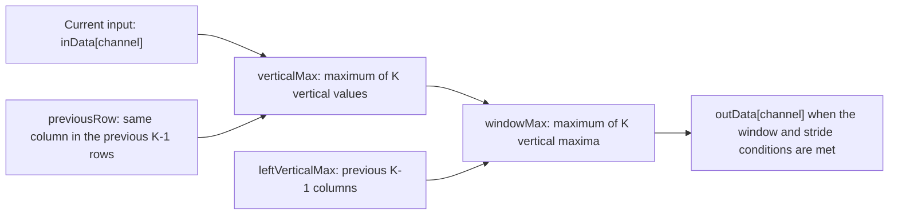
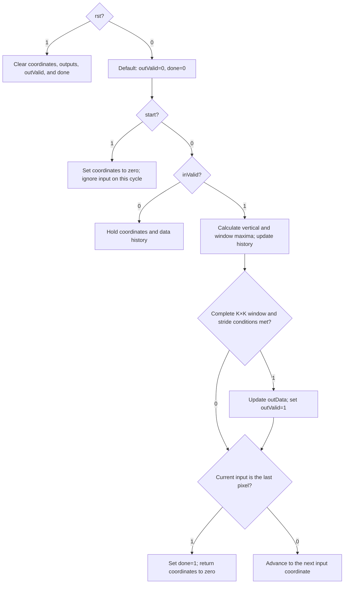

# maxPool: Configurable Kernel Size and Stride

The module is named `maxPool`. The source file retains the name
`maxPool2x2_stream.sv` for compatibility with existing project paths, but
the module supports configurable square kernels, not just 2×2 pooling.

## Configuration and Connection

`kernelSize` specifies the side length of the square pooling window.
`stride` specifies the distance between successive window positions.
Both are compile-time parameters, not runtime control inputs.
Both default to 2.

```systemverilog
logic [7:0] convData[0:7];
logic [7:0] poolData[0:7];
logic poolValid, poolDone;

maxPool#(
    .channels(8),
    .inHeight(28),
    .inWidth(28),
    .dataWidth(8),
    .kernelSize(3),
    .stride(2)
) pool(
    .clk(clk), .rst(rst), .start(poolStart),
    .inValid(convValid), .inData(convData),
    .outValid(poolValid), .outData(poolData), .done(poolDone)
);
```

This connection example assumes that the surrounding module supplies
`clk`, `rst`, `poolStart`, `convValid`, and `convData`.
It applies a 3×3 window with a stride of 2 to a 28×28 input, producing
a 13×13 output for each channel.

The input and output ports are one-dimensional unpacked channel arrays.
`inData[channel]` carries the value of one channel at the current spatial
position. All channels at that position arrive together, and spatial
positions arrive over time in row-major order.
Connecting modules requires matching array types, pixel order, and valid timing.

The parameter constraints are:

- `1 <= kernelSize <= min(inHeight,inWidth)`
- `stride >= 1`
- `channels >= 1` and `dataWidth >= 1`

Comparisons are unsigned. No padding is applied.
`kernelSize=1` is supported.
The output dimensions are:

```text
outHeight = floor((inHeight - kernelSize) / stride) + 1
outWidth  = floor((inWidth  - kernelSize) / stride) + 1
```

## Data Path

Let `K = kernelSize`.

For each channel, the module compares the current input with the values
at the same column in the previous K-1 rows to calculate `verticalMax`.
It then compares the current verticalMax with the vertical maxima of
the previous K-1 columns. The result, `windowMax`, is the maximum value
in the complete K×K window.



`previousRow[channel][rowOffset][columnIndex]` stores pixels from earlier
rows. Offset 0 holds the previous row, offset 1 holds the row before that,
and so on.

`leftVerticalMax[channel][colOffset]` stores vertical maxima from earlier
columns. Offset 0 holds the previous column's vertical maximum.

History arrays are updated using nonblocking assignments, so comparisons
use the stored values from before the current clock update.
The temporary values `inputValue`, `verticalMax`, and `windowMax` use
blocking assignments to calculate the result within that update.

For K>1, the logical history storage is:

```text
Row history:    channels * (kernelSize-1) * inWidth * dataWidth bits
Column history: channels * (kernelSize-1) * dataWidth bits
```

These counts exclude output registers and counters.
For K=1, history is unused; `historySize=1` only keeps the array declarations
valid. Larger kernels require more history storage and comparison logic.
Actual RAM/register mapping and timing depend on synthesis.

## Control Flow

There is no explicitly encoded FSM state register.
The diagram describes branches within a clock update; the boxes do not
represent separate multi-cycle FSM states.
Reset is asynchronous and active high. Normal processing occurs on
the rising edge of `clk`.



The current input coordinate is the bottom-right corner of the candidate
pooling window. An output is produced when all these conditions hold:

```text
rowIndex >= kernelSize-1
columnIndex >= kernelSize-1
(rowIndex - (kernelSize-1)) % stride == 0
(columnIndex - (kernelSize-1)) % stride == 0
```

## Interface Timing and Frame Handling

`start` has priority over `inValid`. Assert start on a clock before the
first valid pixel of a new frame. If both signals are high on the same
clock, that pixel is not consumed.

With `start=0` and `inValid=0`, coordinates and history remain unchanged.
There is no ready signal or output backpressure: the receiver must accept
each output when `outValid=1`.

Except during reset, `outData` retains its previous value when
`outValid=0`. Consecutive outputs can keep outValid high across consecutive
clocks; each high cycle represents a new output.

`done` is asserted when the last input pixel is consumed.
Depending on stride, the last pooling output may occur earlier.
Coordinates automatically return to zero at the end of a frame, allowing
the next frame to arrive without another start pulse.
The module also accepts valid input before start, so the source must
control when valid pixels are supplied.

The history arrays do not need to be cleared by reset or start.
Before any output is enabled, the required history has been filled with
data from the current frame. At each new row, output is suppressed for
the first K-1 columns, allowing the horizontal history to be replaced
before it is used for a valid result.
