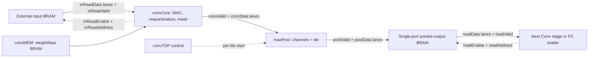

# CNN Integration: Streaming Conv-Pool Stages and BRAM

This document describes the implemented stage and the remaining whole-network
integration work. The module in convTOP.sv is now named convTOP, not convBRAM.
Layer dimensions, pooling settings, quantization, and weights must match the
trained network. A complete MNIST inference top is not yet implemented.

## 1. Current Modules

| Module | Implemented role | Remaining work |
|---|---|---|
| convTOP | Input BRAM interface, convMEM, convCore, direct maxPool, pooled-output SPRAM, stage completion | Instantiate/configure each layer and wire its input buffer |
| convCore | Addressed input reads; MAC, requantization, mask; raw tile output stream | No full input/output array storage; fixed-latency memory contract must be met |
| convMEM | Weight/bias XPM memories | Provide each layer's exported files |
| maxPool | Configurable square unsigned pooling, kernel and stride | Already connected inside convTOP |
| requantUsign | Lane-array requantization inside convCore | Select per-layer scale/width |
| functions.sv | Array relu, sign, argmax | Connect only functions required by the model |
| fcCore_pipe | Existing flat-input FC computation | Fix inWIdth/inWidth mismatch and migrate activation delivery to BRAM |
| featureMapMEM | Optional standalone memory wrapper | Not required by convTOP, which instantiates XPM directly |
| maskGenerator | Not implemented | Build a complete keep mask from valid SNG samples |
| nnController / nnTOP | Not implemented | Sequence layers, buffer ownership, FC, and classification |

convCore is inside convTOP; they are not consecutive neural-network layers.
maxPool's filename is maxPool2x2_stream.sv, but its kernelSize is configurable.

## 2. Implemented Conv-Pool Data Path



There is no raw Conv feature-map BRAM between Conv and Pool. Conv streams
positions in row-major order within each output tile. Pool consumes only
valid samples, so the gaps between Conv results need no FIFO.

The accepted external start starts both Conv and Pool. The core takes several
cycles before producing its first sample. At each intermediate tile end,
poolDone supplies the next Pool start during the core's bias-loading gap.
Pool start and input-valid must never overlap; the wrapper checks this in RTL
simulation. No separate buffered-pooling reader is required.

The Pool output is registered. The wrapper writes it on the next rising edge,
increments poolWriteCount, and packs lane 0 into the least-significant bits.
The raw convAddress is not used as the pooled memory address.

## 3. Dimensions and Memory Layout

In convTOP the names have these meanings:

```text
convHeight = (inHeight + 2*padH - kernelH)/strideH + 1
convWidth  = (inWidth  + 2*padW - kernelW)/strideW + 1
outHeight  = (convHeight - poolKernelSize)/poolStride + 1
outWidth   = (convWidth  - poolKernelSize)/poolStride + 1
outDepth   = (outChannels/tile)*outHeight*outWidth
wordWidth  = tile*actWidth
address    = tileIndex*outHeight*outWidth + row*outWidth + column
channel    = tileIndex*tile + lane
```

Division is integer division for valid positive dimensions; pooling has no
padding and drops incomplete trailing windows. poolKernelSize and poolStride
default to 2. Use kernel=1, stride=1 for an identity Pool where the model has no
pooling; this does not change requantization or the channel mask.

convCore itself still calls the raw Conv dimensions outHeight/outWidth.
The wrapper passes its convHeight/convWidth to those core parameters.

For example, with C=32, tile=8, raw Conv size 28x28, 8-bit activations, and
2x2/stride-2 Pool, the output is 14x14. The stored buffer has 784 64-bit words
(6,272 bytes) instead of 3,136 raw words (25,088 bytes). Pool still needs its
row/window history; these payload figures are not FPGA utilization reports.

## 4. Completion, Reset, and Single-Port Ownership

convTOP busy covers Conv, Pool, and final memory-write drain. Starts received
while busy are ignored. Use a one-cycle start when idle.

The wrapper latches core completion, counts Pool tile completions, and counts
committed pooled writes. done pulses for one clock only after all three agree:
Conv is finished, numTile input tiles are consumed, and outDepth output words
are stored. Registered counters are checked on the following edge.

This is deliberately different from convCore.done and maxPool.done:

- core done means its last raw sample reached the downstream receiver;
- Pool done means the tile's last input sample was consumed;
- convTOP done means the complete pooled feature map is stored.

When a stride leaves trailing unused input positions, all pooled writes can
finish before Conv finishes. The wrapper still waits for Conv and all Pool
tile completions. If the final Pool output coincides with the final input, it
still waits for that output's BRAM write.

The output memory is xpm_memory_spram. Writes own its address port during the
run. Reads are accepted only when reset, busy, start, and writeRequest are low.
Rejected requests are not queued. Read data is meaningful only with readValid,
not merely readEnable; readLatency defaults to 2.

Before the next start, stop reads and consume all outstanding responses.
Do not read before a completed run: the wrapper has no persistent frame-valid
flag. Reset clears control, valid pipelines and Pool indices, not every RAM
word. A reset-aborted output is invalid until a new run fully overwrites it.
Reset or drain the input memory's response-valid path on abort as well.

## 5. Connecting Two Stages

Configure the second stage using the FIRST stage's final pooled output:

| Consumer setting | Producer setting |
|---|---|
| inChannels | outChannels |
| inHeight / inWidth | outHeight / outWidth (after Pool) |
| dataWidth | actWidth |
| inTile | tile |
| inReadLatency | readLatency |

Connect the four ports as follows:

```text
second.inReadEnable  -> first.readEnable
second.inReadAddress -> first.readAddress
first.readValid     -> second.inReadValid
first.readData      -> second.inReadData
```

The second stage's output tile may differ from the first stage's tile.
inTile describes the input buffer's layout, not the new compute parallelism.

convCore computes the requested input word and lane internally:

```text
group   = inputChannel / inTile
lane    = inputChannel % inTile
address = group*inHeight*inWidth + inputRow*inWidth + inputColumn
```

Every non-padding request must be accepted, and data/valid must return with
the configured fixed latency. There is no ready signal or variable-latency
stall support. Padding issues no input read and contributes zero to the MAC.
Input data, lane selection and padding metadata are aligned with weights.

Start the second stage only after first.done, and keep the first stage idle
until the second finishes. Use distinct input and output buffers; overwriting
an input pixel early can corrupt later windows or channel tiles. Shared
readers require external arbitration that preserves the fixed-latency contract.

For the first layer, provide an image BRAM and loader with the same read
interface. The testbench loader is not a board-level image-input subsystem.

## 6. Network Sequencing, Masks, and FC

A network controller can execute fixed-parameter stages sequentially:

1. Finish loading the input image.
2. Prepare the first stage's complete channel mask and pulse its start.
3. Wait for stage done, then start the next stage with its own mask.
4. After the last Conv-Pool stage, run the required FC stages.
5. Capture signed final scores, apply argmax, and publish resultValid.

Parameters are elaboration-time constants; a controller cannot change channel
counts, dimensions, or Pool kernels at runtime. Sharing one compute engine
between differently shaped layers requires a separate configurable design.

The mask has one bit per global output channel: 1 keeps, 0 drops. It is latched
at accepted start, applied after requantization and before Pool, and stays fixed
across the image. Dropped lanes remain zero through unsigned MaxPool. Use all
ones when disabling channel dropping. An external SNG controller must collect
valid samples before start; invert SNG bits if 1 denotes drop rather than keep.
The current design does not rescale retained channels.

FC must read the model's flatten order, not assume BRAM word order is the same.
For channel-major flattening, map logical index i to channel=i/(H*W), then row
and column, and use the group/lane mapping above. Match the exported weights.
Preserve final signed scores and their ordering before argmax; unsigned clipping
is not an appropriate default for the final classifier.

Compile functions.sv OR functions.v, not both. Compile requantize.v in
SystemVerilog mode. The existing requantSign outMax declaration also needs
correction before relying on the signed requantization path; Conv currently
uses requantUsign.

## 7. Remaining Implementation Work

- Build the first-image BRAM loader and instantiate the required convTOP stages.
- Wire each next input to the previous pooled-output memory and sequence starts.
- Adapt FC input reads and weight/bias memory wiring.
- Add nnController, complete SNG mask generation, and final result delivery.
- Compare full-network results against the quantized software model.
- Synthesize and implement for the chosen FPGA to measure resources and timing.

Conv-to-Pool streaming, per-tile starts, pooled storage, and stage completion
are now implemented. Full CNN integration and board validation remain separate.
