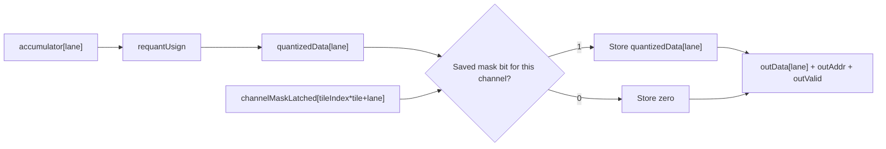
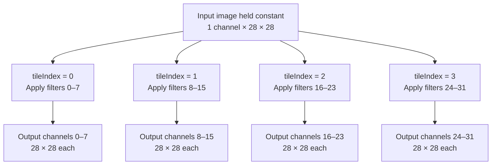
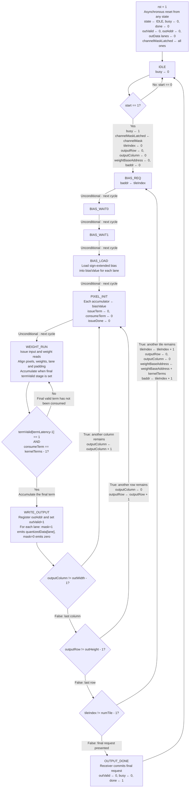
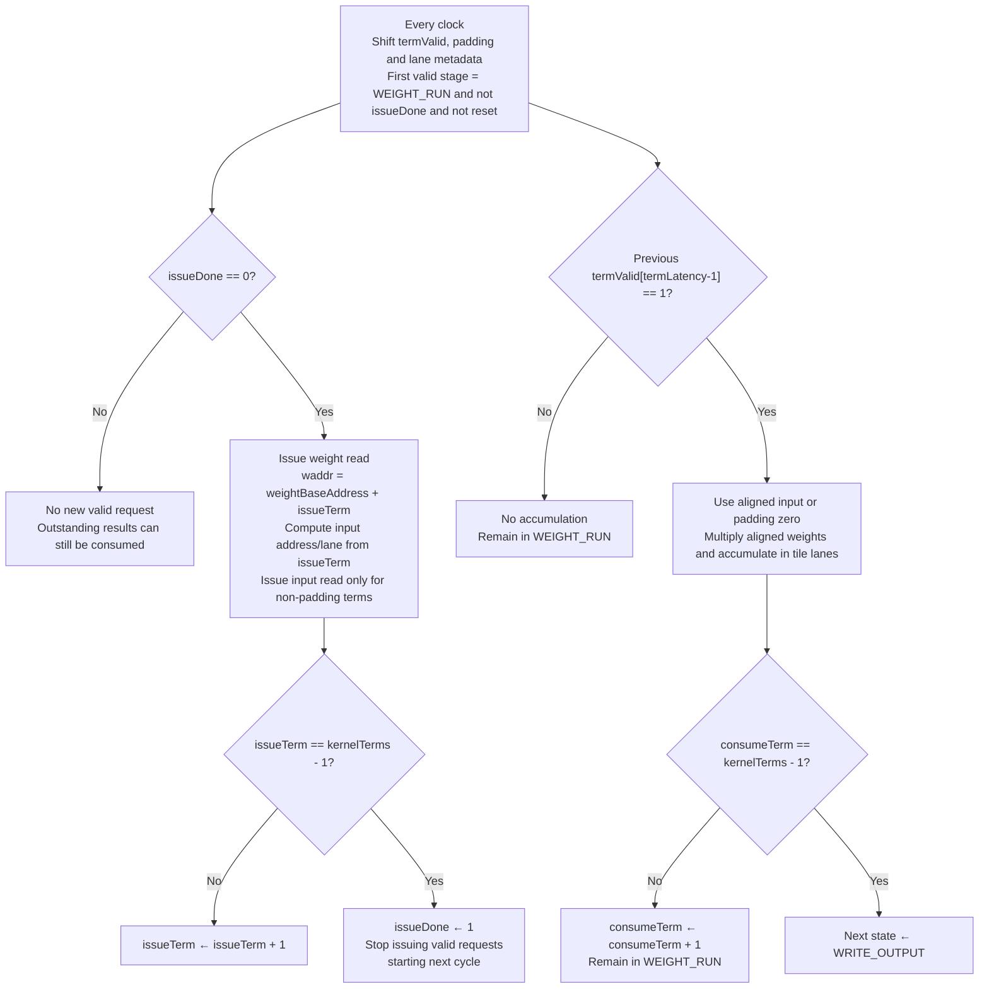

# convCore: BRAM Input Reads, Output Writes, and Channel Masking

`convCore` computes convolution outputs in groups of `tile` channels.
Each accumulator is requantized and masked, then emitted as a registered
tile stream with an address. A receiver can store it directly; convTOP instead
passes it to MaxPool before storage. The core no longer stores
the complete output feature map. Input activations are fetched from an external
synchronous memory; the full input array port has been removed. Weight/bias
reads retain their existing interface and fixed two-cycle latency.

`convTOP.sv` (module `convTOP`, renamed from `convBRAM`) connects the core's
lane stream directly to maxPool, then stores only pooled results in an
internal single-port XPM output BRAM (`xpm_memory_spram`). It exposes
`readEnable`, `readAddress`, `readValid`,
and `readData[lane]` instead of a full output array. No feature-map BRAM is
instantiated by `convCore` itself; `featureMapMEM.sv` is not required by convTOP.

## convTOP Pooling and Completion

The data path is input BRAM -> convCore (MAC, requantization, mask) -> maxPool
-> single-port output BRAM. There is no full raw-Conv output buffer. Pool uses
its existing row/window history. convCore and maxPool arithmetic are unchanged.

New parameters poolKernelSize=2 and poolStride=2 configure square, unsigned,
unpadded pooling. poolKernelSize=1, poolStride=1 is an identity operation when
a layer should not downsample. Parameters must match the trained model.

In convTOP, convHeight/convWidth are the pre-Pool dimensions; outHeight/outWidth
now describe the pooled feature map (a change from the old wrapper):

```text
convHeight = (inHeight + 2*padH - kernelH)/strideH + 1
convWidth  = (inWidth  + 2*padW - kernelW)/strideW + 1
outHeight  = (convHeight - poolKernelSize)/poolStride + 1
outWidth   = (convWidth  - poolKernelSize)/poolStride + 1
outDepth   = numTile*outHeight*outWidth
```

These use integer division for valid positive dimensions. The core itself
still calls its pre-Pool dimensions outHeight/outWidth; convTOP passes
convHeight/convWidth to those core parameters. convAddress is NOT the pooled
memory address. Sequential poolWriteCount addresses produce the same
tile-major, row-major layout at the smaller output resolution.

coreStart accepts start only while the wrapper is idle. It starts both Conv
and Pool before the first Conv sample. Pool channels=tile; convValid and
convData directly drive Pool inValid and inData. poolDone marks the end of
one tile's input stream and starts Pool again for the next tile. The existing
core's inter-tile bias-loading gap provides the required empty start cycle;
an assertion detects any start/data overlap. Starts received while busy are
ignored. No FIFO or backpressure was added.

busy covers the entire Conv-Pool run. convDone is internal and is latched as
convFinished. poolTiles counts tile-input completions; poolWriteCount counts
actual BRAM writes. The wrapper pulses done only after Conv is finished, all
tiles are consumed, and all outDepth pooled words have been committed. It
uses registered counters, so completion is checked on the following edge.
This also handles strides where the last Pool output precedes the last input.
Neither core done nor Pool done alone is exposed as the wrapper's completion.

## Input Memory Interface (Breaking Port Change)

Both convCore and convTOP expose:

```systemverilog
parameter int inTile=1, inReadLatency=2,
parameter int inDepth=((inChannels+inTile-1)/inTile)*inHeight*inWidth,
parameter int inAddrW=(inDepth>1)?$clog2(inDepth):1

output logic inReadEnable,
output logic[inAddrW-1:0] inReadAddress,
input logic inReadValid,
input logic[dataWidth-1:0] inReadData[0:inTile-1]
```

inTile is the number of channels packed into the PRODUCER's memory word; tile
is the number of output channels computed in parallel by THIS core. They need
not match. The first grayscale image can use inTile=1. For a previous Conv
or Pool with eight lanes per word, use inTile=8 and the matching dataWidth.
The last input group may contain unused lanes; the core never selects those
lanes. Output channels still require complete output tiles.

The producer must store words in channel-group-major, then row-major order:

```text
group   = inputChannel / inTile
lane    = inputChannel % inTile
address = group*inHeight*inWidth + inputRow*inWidth + inputColumn
word[lane*dataWidth +: dataWidth] = activation of that input channel
```

The core issues at most one input-word read per cycle. There is no request
ready signal: every asserted inReadEnable must be accepted at the rising edge.
inReadLatency must match the external memory's fixed read latency (1..100).
If a request is accepted at edge E0 and latency is L, its data/valid must be
visible after E(L-1), and the core samples them at E(L). For example, L=2
means the memory presents the response after E1 and the core samples at E2.
This matches the convTOP/featureMapMEM read ports.

inReadValid is a fixed-latency contract check, not a stall/ready handshake.
The core does not wait for variable-latency responses. A missing response at
the configured cycle is fatal in RTL simulation; synthesis excludes that
check. Feed this port from a dedicated, available memory, not a contended bus.

Padding creates a zero-valued MAC term but no input memory request. The core
keeps each term's valid bit, padding flag, and lane selector aligned. Inputs
faster than the two-cycle weight memory are delayed; slower inputs cause the
weights to be delayed. termLatency=max(2,inReadLatency). After filling the
pipeline, one term per cycle can be consumed. This version does not cache
repeated words or windows; it may reread the same word for different channels
or output positions. Larger latency adds pipeline fill/drain overhead per pixel.

Before start, finish loading the input buffer and stop modifying it. Keep its
contents stable until done. Reset flushes the core's metadata/data pipelines;
also reset or drain the external memory's response-valid pipeline before restart.
Do not alias this run's input and output storage: later windows/tiles still
need earlier input pixels.

For two sequential convTOP stages, connect the consumer's
inReadEnable/inReadAddress to the producer's readEnable/readAddress, and the
producer's readValid/readData to the consumer's inReadValid/inReadData. Match
consumer inChannels/inHeight/inWidth/dataWidth to producer
outChannels/outHeight/outWidth/actWidth, consumer inTile to producer tile, and
consumer inReadLatency to producer readLatency. Start the consumer only after
producer done; keep the producer idle until the consumer finishes. External
arbitration is needed if another reader also uses the producer's port.

## convTOP Pooled-Output Read Interface

The wrapper adds `outDepth=numTile*outHeight*outWidth`, the derived `outAddrW`,
and `readLatency=2` parameters. One word holds `tile*actWidth` bits, with lane 0
in the least-significant bits. `readData[0:tile-1]` is an unpacked lane array.

Present `readEnable=1` and a valid `readAddress` before a rising edge. With the
default latency of 2, the word and `readValid=1` appear after the following
rising edge. A synchronous consumer captures that response at the next edge.
Consecutive requests are supported; out-of-range requests produce no response.
Use `readValid`, not `readEnable`, as the downstream sample-valid signal.

The output memory has one shared read/write address port. Writes have priority:
`memoryAddress` selects `convAddress` on a write and `readAddress` otherwise.
`memoryEnable` is the OR of accepted writes and reads. A read is accepted only
when reset, busy, start, and writeRequest are all low and its address is valid.
Blocked read requests are ignored, not queued. A readEnable held high becomes
a fresh request on every eligible edge after the Conv run ends.

The read-valid pipeline tracks only accepted reads, never memoryEnable.
In read-first mode a write can also update the RAM output with its previous
contents, but that write does not generate readValid. Accumulation remains in
the core's registers; intermediate sums are not read from output BRAM.

Wait for `done` before reading a completed frame. The final pooled write is
already committed when `done` rises. Reset clears pending read-valid state, not
BRAM contents; hold reset through a rising edge and regenerate aborted frames.
The input memory interface is separate from this output memory port.
Before starting another frame, stop issuing reads and consume all outstanding
read responses. The wrapper does not wait for them before accepting start,
and start does not cancel previously accepted reads. It also does not track
whether an idle buffer contains a completed frame; the caller must do so.

## Output Write Interface

This section describes convCore's pre-Pool stream, not convTOP's final memory.
In convTOP, the synchronous receiver is maxPool rather than the output BRAM.

```systemverilog
parameter int outDepth=numTile*outHeight*outWidth,
parameter int outAddrW=(outDepth>1)?$clog2(outDepth):1

output logic outValid,
output logic[outAddrW-1:0] outAddr,
output logic[actWidth-1:0] outData[0:tile-1]
```

The destination samples all three outputs on a rising edge of the same clock.
When `outValid=1`, it must write every lane to the specified word address.
There is no ready/backpressure input: every valid request must be accepted.
Addresses and data are meaningful for writes only while outValid is high.
Outside valid cycles they retain their previous values, except during reset.

One address stores `tile` channels at one spatial position:

```text
outAddr = tileIndex*(outHeight*outWidth) + outputRow*outWidth + outputColumn
globalChannel = tileIndex*tile + lane
wordWidth = tile*actWidth bits
```

Writes proceed through columns, then rows, then tiles. The core emits exactly
outDepth requests per completed run, with addresses from 0 through outDepth-1.
For tile=8, outChannels=32, outHeight=28, outWidth=28, and actWidth=8:

| Address range | Channels | Word width |
|---|---|---|
| 0–783 | 0–7 | 64 bits |
| 784–1567 | 8–15 | 64 bits |
| 1568–2351 | 16–23 | 64 bits |
| 2352–3135 | 24–31 | 64 bits |

A memory wrapper can pack the lane array locally into an XPM data word, with
lane 0 in its least-significant actWidth bits. This is wiring, not storage
of the complete feature map inside the core.

## Write and Completion Timing

Outputs are registered in WRITE_OUTPUT. A synchronous receiver consumes the
request at the following rising edge. The final result uses OUTPUT_DONE to
ensure that done does not precede this write.

| Edge | Core action after the edge | Receiver action at the edge |
|---|---|---|
| E0: final WRITE_OUTPUT | Present final address/data; outValid=1; busy remains 1 | Does not yet see the newly registered request |
| E1: OUTPUT_DONE | outValid=0; busy=0; done=1; enter IDLE | Commit the final request presented since E0 |
| E2: IDLE | done=0; may accept a new start | No further write from the completed run |

This completion contract assumes a direct, same-clock synchronous write
receiver with no extra write queue. If another pipeline or FIFO is added,
its own drain/completion timing must also be considered.

Reset clears outValid, outAddr, the tile output registers, and control state.
It no longer clears a full output feature map. Reset during a run aborts that
run; partially written external memory must not be treated as a complete frame.
External memory contents need not be cleared if each new completed run
overwrites every address and every lane, including zeros for dropped channels.

## Channel Mask Interface

```systemverilog
input logic [outChannels-1:0] channelMask;
logic [outChannels-1:0] channelMaskLatched;
```

Each bit controls one output channel, including all spatial positions in that
channel. A bit value of 1 keeps the requantized result; 0 drops the channel.
For example, `channelMask=4'b1011` keeps channels 0, 1, and 3 and drops channel 2.
Connect `channelMask` to `'1` to keep every channel; do not leave it unconnected.

The wrapper preserves the mask connection:

```systemverilog
.channelMask(channelMask)
```

### Mask Capture and Lifetime

Reset initializes `channelMaskLatched` to all ones. In `IDLE`, an accepted
`start` captures the external mask:

```systemverilog
channelMaskLatched <=channelMask;
```

Present a complete, stable mask before the rising clock edge that accepts start.
The saved mask remains unchanged throughout that convolution run, so changes to
the external input while the core is busy do not affect the current result.
A new mask is captured on the next start accepted in `IDLE`.
Reset initialization does not replace the need to supply a valid mask at start.

### Applying the Mask

In `WRITE_OUTPUT`, the core presents a registered write request. The global
output-channel index used for masking is `tileIndex*tile+lane`:

```systemverilog
outValid <=1'b1;
outAddr <=outAddrW'(tileIndex*(outHeight*outWidth)
    +outputRow*outWidth+outputColumn);
for(lane=0; lane<tile; lane++)begin
    if(channelMaskLatched[tileIndex*tile+lane])
        outData[lane] <=quantizedData[lane];
    else
        outData[lane] <='0;
end
```

For `tile=8`, `tileIndex=1`, and `lane=2`, this selects mask bit 10.
The mask is indexed by global channel, not reused from bit zero for each tile.
The current implementation assumes `outChannels` is divisible by `tile`, since
`numTile=outChannels/tile` and partial tiles are not handled.

Masking occurs as each computed pixel is emitted for writing. It does not wait until the
entire feature map has been computed. The same saved mask is used for every
pixel, making the completed dropped channel all zeros.
Multiplications, accumulations, and memory accesses still take place for dropped
channels, so masking does not reduce the convolution cycle count.
Kept channels are not rescaled by a probability-dependent factor.

## Requantization Data Path

Requantization uses unpacked lane arrays directly:

```systemverilog
logic signed[accWidth-1:0] accumulator[0:tile-1];
wire[actWidth-1:0] quantizedData[0:tile-1];

requantUsign#(
    .number(tile),.inWidth(accWidth),
    .outWidth(actWidth),.shift(requantShift))
u_requant(
    .inData(accumulator),.outData(quantizedData));
```

There is no intermediate flat-vector packing. Each array element is one lane
at the current output pixel. `requantUsign` applies nonnegative clipping,
rounding/right-shifting for the usual positive `requantShift`, and unsigned
saturation before the channel mask selects the stored value.
The requantizer is combinational and does not introduce an extra FSM state.



## SNG Integration Boundary

The core receives a complete `channelMask`; it does not receive or sample
`random_bit` / `random_valid` directly. An external mask-generation controller
still needs to collect SNG samples into one bit per output channel and start
the convolution only after the complete mask is ready.

If an SNG bit of 1 means keep, store it directly in the mask. If it means drop,
invert it first. This distinction determines whether the SNG's probability of
outputting 1 is the keep probability or the drop probability.
Using a different sample for each channel allows different channel decisions;
replicating one bit across the mask makes all channels share one decision.

## Same input image, different filters

The example below uses `tile=8` and `outChannels=32`. Each group is subject to
its corresponding saved mask bits.



## Complete FSM



## The pipeline runs inside <WEIGHT_RUN>



## Integration Work Still Required

- convTOP now implements Conv -> MaxPool -> BRAM, including tile-start and
  pooled-write completion control. Its read port exposes pooled data; no
  separate featureMapMEM instance or raw-output buffer is required.
- Provide the first-image BRAM/loader and wire each later layer's input port
  to the preceding producer's output buffer. The core-side reader and timing
  alignment are implemented; there is no full-array compatibility adapter.
- FC input delivery and the network-level controller must follow the chosen
  feature-map layout and completion handshake.

These interface changes do not themselves establish device resource usage or
timing closure. Full network integration and target-device implementation are
still needed for a complete hardware resource assessment.
