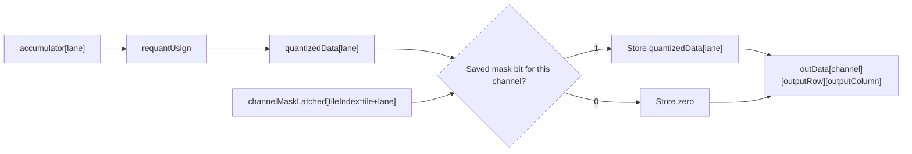
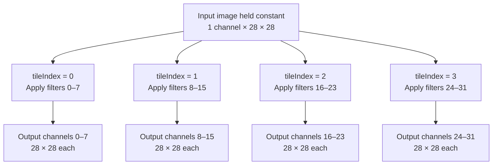
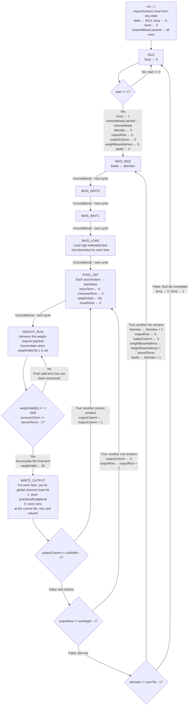
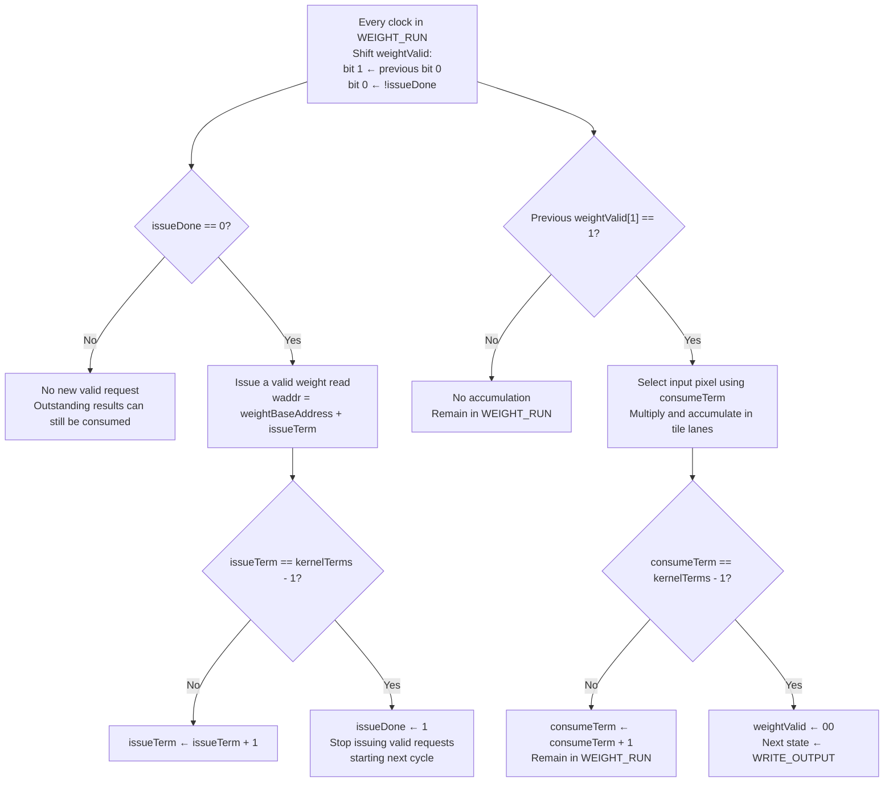

# convCore: Convolution, Requantization, and Channel Masking

`convCore` computes convolution outputs in groups of `tile` channels.
Each accumulator is requantized and then either stored or replaced with zero
according to a channel mask. The `convBRAM` wrapper in `convTOP.sv` connects
the weight/bias memory and forwards the external mask to the core.

## Channel Mask Interface

```systemverilog
input logic [outChannels-1:0] channelMask;
logic [outChannels-1:0] channelMaskLatched;
```

Each bit controls one output channel, including all spatial positions in that
channel. A bit value of 1 keeps the requantized result; 0 drops the channel.
For example, `channelMask=4'b1011` keeps channels 0, 1, and 3 and drops channel 2.
Connect `channelMask` to `'1` to keep every channel; do not leave it unconnected.

The wrapper passes the mask directly to the core:

```systemverilog
.channelMask(channelMask)
```

### Mask Capture and Lifetime

Reset initializes `channelMaskLatched` to all ones. In `IDLE`, an accepted
`start` captures the external mask:

```systemverilog
channelMaskLatched <=channelMask;
```

Present a complete, stable mask before the rising clock edge that accepts start.
The saved mask remains unchanged throughout that convolution run, so changes to
the external input while the core is busy do not affect the current result.
A new mask is captured on the next start accepted in `IDLE`.
Reset initialization does not replace the need to supply a valid mask at start.

### Applying the Mask

In `WRITE_OUTPUT`, the global output-channel index is `tileIndex*tile+lane`:

```systemverilog
for(lane=0; lane<tile; lane++)begin
    if(channelMaskLatched[tileIndex*tile+lane])
        outData[tileIndex*tile+lane][outputRow][outputColumn]
            <=quantizedData[lane];
    else
        outData[tileIndex*tile+lane][outputRow][outputColumn] <='0;
end
```

For `tile=8`, `tileIndex=1`, and `lane=2`, this selects mask bit 10.
The mask is indexed by global channel, not reused from bit zero for each tile.
The current implementation assumes `outChannels` is divisible by `tile`, since
`numTile=outChannels/tile` and partial tiles are not handled.

Masking occurs as each computed pixel is written. It does not wait until the
entire feature map has been computed. The same saved mask is used for every
pixel, making the completed dropped channel all zeros.
Multiplications, accumulations, and memory accesses still take place for dropped
channels, so masking does not reduce the convolution cycle count.
Kept channels are not rescaled by a probability-dependent factor.

## Requantization Data Path

Requantization uses unpacked lane arrays directly:

```systemverilog
logic signed[accWidth-1:0] accumulator[0:tile-1];
wire[actWidth-1:0] quantizedData[0:tile-1];

requantUsign#(
    .number(tile),.inWidth(accWidth),
    .outWidth(actWidth),.shift(requantShift))
u_requant(
    .inData(accumulator),.outData(quantizedData));
```

There is no intermediate flat-vector packing. Each array element is one lane
at the current output pixel. `requantUsign` applies nonnegative clipping,
rounding/right-shifting for the usual positive `requantShift`, and unsigned
saturation before the channel mask selects the stored value.
The requantizer is combinational and does not introduce an extra FSM state.



## SNG Integration Boundary

The core receives a complete `channelMask`; it does not receive or sample
`random_bit` / `random_valid` directly. An external mask-generation controller
still needs to collect SNG samples into one bit per output channel and start
the convolution only after the complete mask is ready.

If an SNG bit of 1 means keep, store it directly in the mask. If it means drop,
invert it first. This distinction determines whether the SNG's probability of
outputting 1 is the keep probability or the drop probability.
Using a different sample for each channel allows different channel decisions;
replicating one bit across the mask makes all channels share one decision.

## Same input image, different filters

The example below uses `tile=8` and `outChannels=32`. Each group is subject to
its corresponding saved mask bits.



## Complete FSM



## The pipeline runs inside <WEIGHT_RUN>


