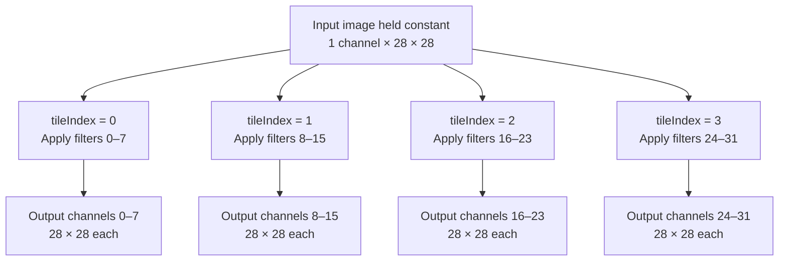
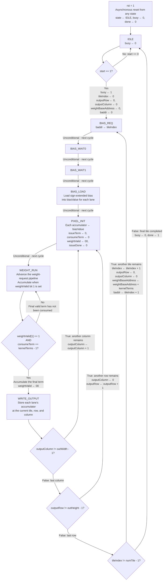
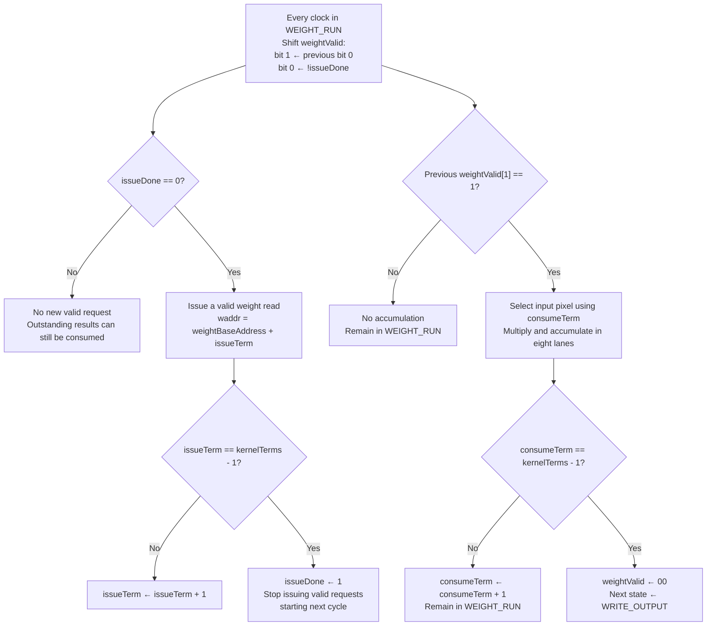

## Same input image, different filters

```mermaid
flowchart TD
    I["Input image held constant<br/>1 channel × 28 × 28"]
    T0["tileIndex = 0<br/>Apply filters 0–7"]
    T1["tileIndex = 1<br/>Apply filters 8–15"]
    T2["tileIndex = 2<br/>Apply filters 16–23"]
    T3["tileIndex = 3<br/>Apply filters 24–31"]
    O0["Output channels 0–7<br/>28 × 28 each"]
    O1["Output channels 8–15<br/>28 × 28 each"]
    O2["Output channels 16–23<br/>28 × 28 each"]
    O3["Output channels 24–31<br/>28 × 28 each"]

    I --> T0 --> O0
    I --> T1 --> O1
    I --> T2 --> O2
    I --> T3 --> O3
```

## Complete FSM

```mermaid
flowchart TD
    RESET["rst = 1<br/>Asynchronous reset from any state<br/>state ← IDLE, busy ← 0, done ← 0"]

    IDLE["IDLE<br/>busy ← 0"]
    START{"start == 1?"}

    RESET --> IDLE
    IDLE --> START
    START -->|"No: start == 0"| IDLE
    START -->|"Yes<br/>busy ← 1<br/>tileIndex ← 0<br/>outputRow ← 0, outputColumn ← 0<br/>weightBaseAddress ← 0, baddr ← 0"| BREQ

    BREQ["BIAS_REQ<br/>baddr ← tileIndex"]
    BW0["BIAS_WAIT0"]
    BW1["BIAS_WAIT1"]
    BLOAD["BIAS_LOAD<br/>Load sign-extended bias<br/>into biasValue for each lane"]
    PINIT["PIXEL_INIT<br/>Each accumulator ← biasValue<br/>issueTerm ← 0, consumeTerm ← 0<br/>weightValid ← 00, issueDone ← 0"]

    BREQ -->|"Unconditional · next cycle"| BW0
    BW0 -->|"Unconditional · next cycle"| BW1
    BW1 -->|"Unconditional · next cycle"| BLOAD
    BLOAD -->|"Unconditional · next cycle"| PINIT
    PINIT -->|"Unconditional · next cycle"| WRUN

    WRUN["WEIGHT_RUN<br/>Advance the weight-request pipeline<br/>Accumulate when weightValid bit 1 is set"]

    LASTTERM{"weightValid[1] == 1<br/>AND<br/>consumeTerm == kernelTerms - 1?"}

    WRUN --> LASTTERM
    LASTTERM -->|"No<br/>Final valid term has not been consumed"| WRUN
    LASTTERM -->|"Yes<br/>Accumulate the final term<br/>weightValid ← 00"| WRITE

    WRITE["WRITE_OUTPUT<br/>Store each lane's accumulator<br/>at the current tile, row, and column"]

    COL{"outputColumn != outWidth - 1?"}
    ROW{"outputRow != outHeight - 1?"}
    TILE{"tileIndex != numTile - 1?"}

    WRITE --> COL
    COL -->|"True: another column remains<br/>outputColumn ← outputColumn + 1"| PINIT
    COL -->|"False: last column"| ROW

    ROW -->|"True: another row remains<br/>outputColumn ← 0<br/>outputRow ← outputRow + 1"| PINIT
    ROW -->|"False: last row"| TILE

    TILE -->|"True: another tile remains<br/>tileIndex ← tileIndex + 1<br/>outputRow ← 0, outputColumn ← 0<br/>weightBaseAddress ← weightBaseAddress + kernelTerms<br/>baddr ← tileIndex + 1"| BREQ

    TILE -->|"False: final tile completed<br/>busy ← 0, done ← 1"| IDLE
```

## The pipeline runs inside <WEIGHT_RUN>

```mermaid
flowchart TD
    RUN["Every clock in WEIGHT_RUN<br/>Shift weightValid:<br/>bit 1 ← previous bit 0<br/>bit 0 ← !issueDone"]

    RUN --> ISSUE{"issueDone == 0?"}
    ISSUE -->|"No"| NOREQ["No new valid request<br/>Outstanding results can still be consumed"]
    ISSUE -->|"Yes"| REQ["Issue a valid weight read<br/>waddr = weightBaseAddress + issueTerm"]

    REQ --> ILAST{"issueTerm == kernelTerms - 1?"}
    ILAST -->|"No"| INEXT["issueTerm ← issueTerm + 1"]
    ILAST -->|"Yes"| IDONE["issueDone ← 1<br/>Stop issuing valid requests<br/>starting next cycle"]

    RUN --> VALID{"Previous weightValid[1] == 1?"}
    VALID -->|"No"| WAIT["No accumulation<br/>Remain in WEIGHT_RUN"]
    VALID -->|"Yes"| MAC["Select input pixel using consumeTerm<br/>Multiply and accumulate in eight lanes"]

    MAC --> CLAST{"consumeTerm == kernelTerms - 1?"}
    CLAST -->|"No"| CNEXT["consumeTerm ← consumeTerm + 1<br/>Remain in WEIGHT_RUN"]
    CLAST -->|"Yes"| FINISH["weightValid ← 00<br/>Next state ← WRITE_OUTPUT"]
```